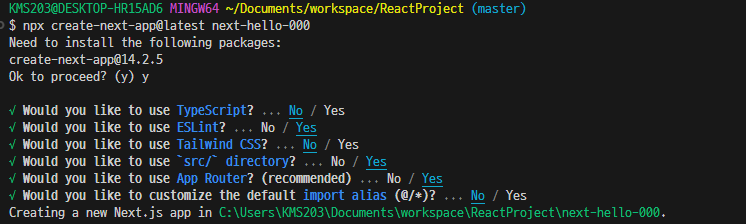

# NextJS framework 를 이용한 back-end + front-end + DB 를 연동한 프로젝트

- {nextJS 공식사이트} : [https://nextjs.org/]

```html
<a href="https://nextjs.org">nextJS 공식사이트</a>
```

## NextJS 프로젝트 생성하기

- 프로젝트 생성하기

```bash
npx create-next-app@latest [project]
```

- 프로젝트 옵션 설정하기



- 프로젝트 실행 : 개발환경 실행

```bash
cd [project]
npm install
npm run dev
```

- 프로젝트 빌드와 실행 : 운영환경 실행

```bash
npm run build
npm run start
```
